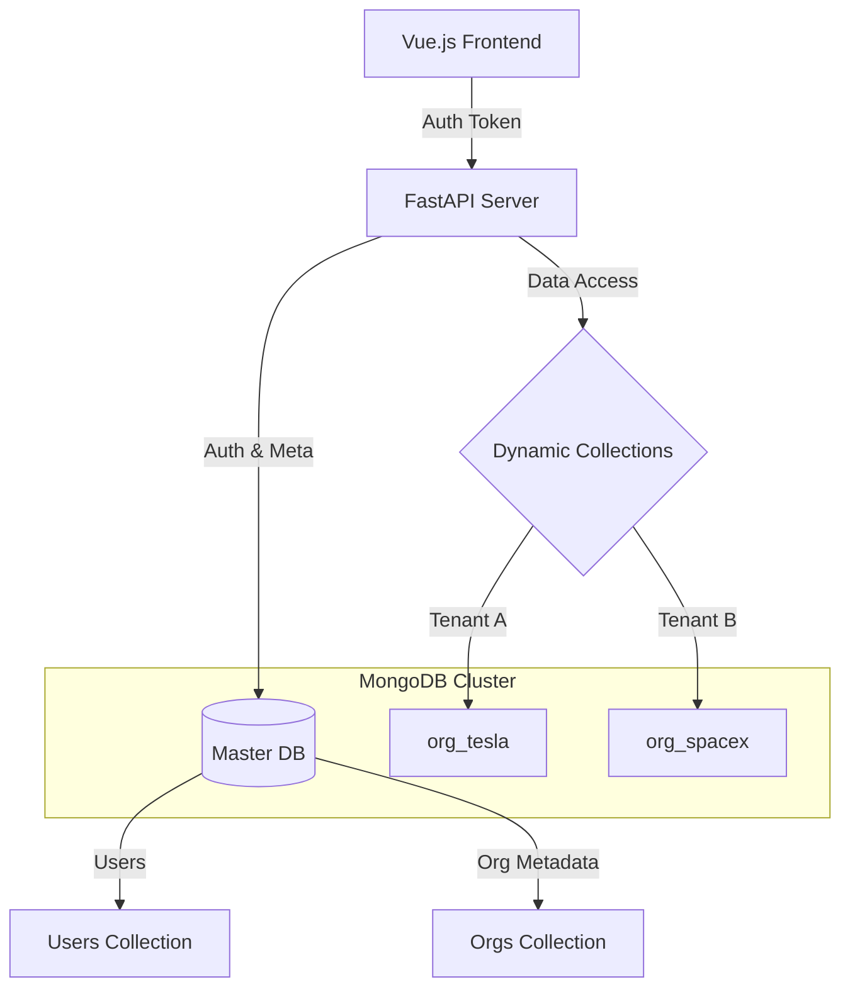

# Organization Management Service

## Architecture
- **Language**: Python 3.9+ (FastAPI)
- **Database**: MongoDB (Motor Async)
- **Deployment**: Vercel Serverless
- **Pattern**: Multi-tenancy with **Single Database, Dynamic Collections** strategy.

### Architecture Diagram


### Design Choices
1. **Dynamic Collections**: Each organization (tenant) gets its own collection (`org_{name}`) created on the fly. This ensures logical data isolation while keeping the database management simple.
2. **Master DB**: Stores `users` and `organizations` metadata in proper collections.
3. **Migration**: Renaming an organization triggers a rename of the underlying collection, ensuring zero data loss and reference consistency (implemented in `OrganizationService`).

## Local Development

### Prerequisites
- Python 3.9+ or Docker
- MongoDB Instance (Atlas or Local)

### Setup
1. Clone the repo
2. Create `.env`:
   ```bash
   MONGO_URL=mongodb+srv://...
   SECRET_KEY=...
   ```
3. Install dependencies:
   ```bash
   pip install -r requirements.txt
   ```
4. Run Server:
   ```bash
   uvicorn app.main:app --reload
   ```
5. Open Dashboard:
   Open `public/index.html` in your browser (or visit http://localhost:8000/ if serving statically).

## API Documentation
Visit `http://localhost:8000/docs` for the interactive Swagger UI.

## Project Structure
- `app/core`: Config and Security
- `app/db`: Database connection logic
- `app/routers`: API endpoints
- `app/services`: Business logic (Org creation/migration)
- `public`: Vue.js Frontend
