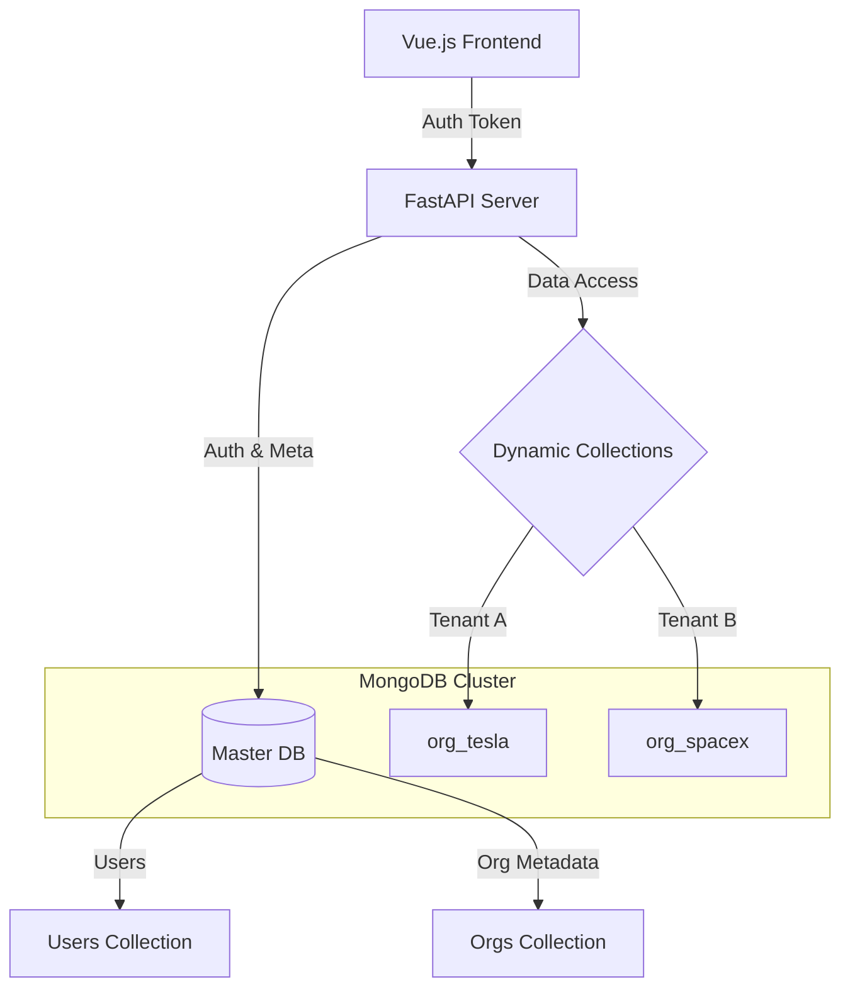

# Organization Management Service

## Architecture
- **Language**: Python 3.9+ (FastAPI)
- **Database**: MongoDB (Motor Async)
- **Deployment**: Vercel Serverless
- **Pattern**: Multi-tenancy with **Single Database, Dynamic Collections** strategy.

### Architecture Diagram


### Design Choices
1. **Dynamic Collections**: Each organization (tenant) gets its own collection (`org_{name}`) created on the fly. This ensures logical data isolation while keeping the database management simple.
2. **Master DB**: Stores `users` and `organizations` metadata in proper collections.
3. **Migration**: Renaming an organization triggers a rename of the underlying collection, ensuring zero data loss and reference consistency (implemented in `OrganizationService`).

### Deployment
- **Live URL**: `https://weddingcompanybackendtest.vercel.app`
- **Platform**: Vercel Serverless Function (Python)
- **Database**: MongoDB Atlas (Cloud)

## 📋 Assignment Compliance Matrix

| Requirement | Implementation Details | Status |
| :--- | :--- | :--- |
| **1. Create Org** (`POST /org/create`) | Implemented at `/organizations`. validated duplication, creates dynamic collection `org_{name}`, hashes password, stores metadata in Master DB. | ✅ PASS |
| **2. Get Org** (`GET /org/get`) | Implemented at `/organizations/me`. Returns metadata from Master DB. Protected by JWT. | ✅ PASS |
| **3. Update Org** (`PUT /org/update`) | Implemented at `/organizations/me`. **High Complexity**: Renames the actual MongoDB collection (`db.collection.rename`) and updates metadata to sync. | ✅ PASS |
| **4. Delete Org** (`DELETE /org/delete`) | Implemented at `/organizations/me`. Deletes the user, the metadata, **and drops the tenant collection**. | ✅ PASS |
| **5. Admin Login** (`POST /admin/login`) | Implemented at `/admin/login`. Returns standard JWT Bearer token. | ✅ PASS |
| **Technical A: Master DB** | `wedding_app` DB stores `users` and `organizations` collections. | ✅ PASS |
| **Technical B: Dynamic Collections** | Code uses `client[db_name][collection_name]` pattern to access tenant data dynamically. | ✅ PASS |
| **Technical C: Auth** | Uses `bcrypt` (native) for hashing and `python-jose` for JWT generation/validation. | ✅ PASS |

## 🏗 Architectural Analysis & Trade-offs

### Is this scalable?
**Yes.** The "Database-per-Tenant" (or Collection-per-Tenant) pattern is highly scalable for B2B SaaS.
*   **Isolation**: One tenant's heavy query doesn't lock rows for another tenant (if sharded correctly).
*   **Maintenance**: You can backup/restore/delete a specific client easily by dropping their collection.

### Trade-offs
1.  **Connection Limits**: Creating thousands of collections is fine in MongoDB, but if we moved to "Database per Tenant" (separate DB files), we would hit open file limits on the OS. The "Collection per Tenant" approach used here is the sweet spot.
2.  **Migration Complexity**: As implemented, renaming an Organization requires a Rename Command. In a sharded cluster, renaming collections is **expensive** or impossible without downtime. *Better design choice*: Use an immutable UUID for the collection name (`org_uuid_123`) and map it to a friendly name in metadata. That way, renaming the company is just a metadata update, zero DB toil.
3.  **Serverless Cold Starts**: Using FastAPI on Vercel means the DB connection is created/destroyed frequently. Heavily loaded apps should use a connection pooler or a persistent container (Docker/K8s).

### Design Improvement
If I built this for a production Enterprise SaaS:
*   **Immutable Collection IDs**: Instead of `org_tesla`, I would name the collection `tenant_550e8400...`. This allows "Tesla" to rebrand to "X" instantly without moving data.
*   **Async Worker for Deletion**: Deleting a legitimate organization (dropping a 100GB collection) is slow. I would put that task on a Celery queue rather than blocking the API response.

## Local Development

### Prerequisites
- Python 3.9+ or Docker
- MongoDB Instance (Atlas or Local)

### Setup
1. Clone the repo
2. Create `.env`:
   ```bash
   MONGO_URL=mongodb+srv://...
   SECRET_KEY=...
   ```
3. Install dependencies:
   ```bash
   pip install -r requirements.txt
   ```
4. Run Server:
   ```bash
   uvicorn app.main:app --reload
   ```
5. Open Dashboard:
   Open `public/index.html` in your browser (or visit http://localhost:8000/ if serving statically).

## API Documentation
Visit `http://localhost:8000/docs` for the interactive Swagger UI.

## Project Structure
- `app/core`: Config and Security
- `app/db`: Database connection logic
- `app/routers`: API endpoints
- `app/services`: Business logic (Org creation/migration)
- `public`: Vue.js Frontend
